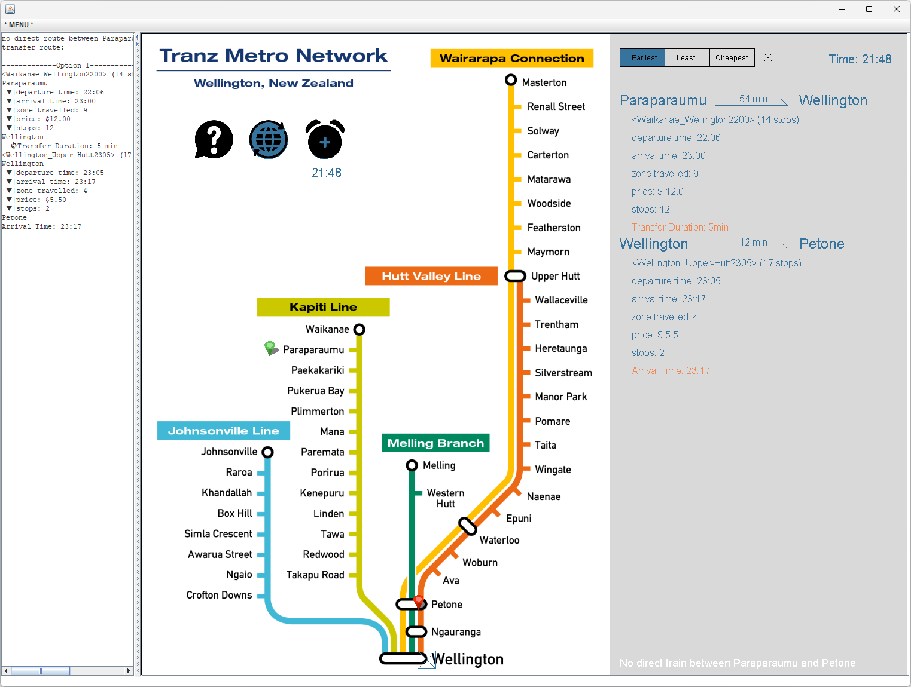

# Wellington Train 
## Introduction:
This is a personal project for school. In this project, we aim to build a train query software based on detailed data from the Wellington train system. This data includes all the train lines, stations information on each line, distances, shifts and schedules of each stations and fare information. All the data is stored in .txt format files for each route and station. The program needs to read and store this data into suitable data structures in memory and then return results based on user queries. One challenging is the transfer algorithm. When there are no direct services, the algorithm needs to find a transfer point to switch to another line. Choosing the transfer point is crucial. From the screenshots of the software interface, we can see that there are often multiple transfer points along the same route heading in the same direction in the Wellington train system. Therefore, finding the nearest transfer point is essential to avoid doubling back. Another challenge is to develop different priority schemes, such as price priority, time priority, distance priority, etc. The final challenge is to present the results in an intuitive and elegant UI.  

Find the executable application (wellington_train.exe) from Google Drive:  
[Edmond's Java Program Collection.zip (Windows)](https://drive.google.com/drive/folders/1ovLlyHeENMtQDsT5b9hJBcHwKPCrC6Mg?usp=sharing)  
Have a try to see if this app can help!
## Snapshot
 

## User Guide
- click on then name of line/station to interact with them.
- the question mark icon is used for enquiring the information of each line/station.
- the global icon is used for setting the origin station and destination station.
- the alarm icon is used for setting your set off time, so that the enquiry result can meet your time.

## Tech Stack 
| Type | Name |
| ----------- | ----------- 
| Programming Language | Java |
| GUI Library | ecs100.jar |

## Run Instruction
### Requirement:
- Java Runtime Environment

### Steps:   
To run the source code in development environment, please follow the steps below:
1. Clone the repository from the GitHub
2. Add ecs100.jar to Build Path
3. Run the *WellingtonTrain_Main.java* in the default package.

## License
MIT